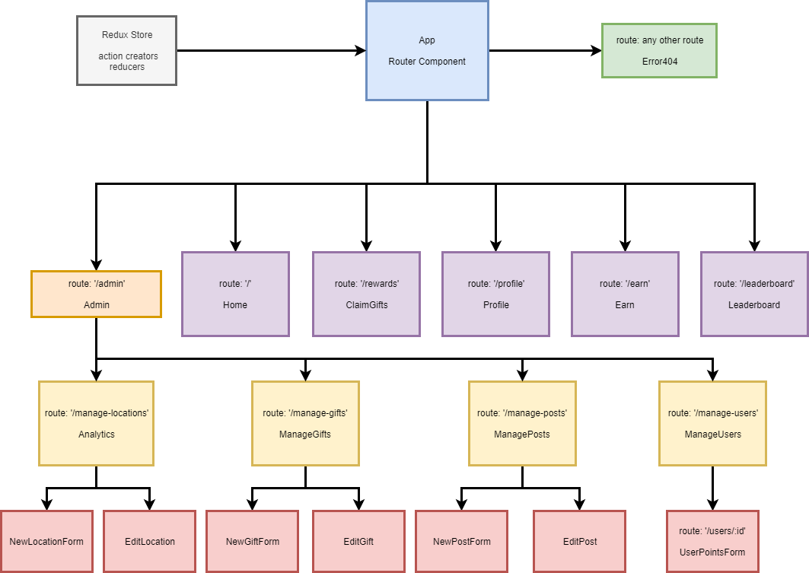

# iLink Rewards ClientApp
##### An App to Manage and Implement iLink System's Rewards Program

## Created 11/14/2018

## Made By

  * Nick Rogers
  * John Murray  

## Description

This app, created in REACT/Redux, displays data upon user authentication through means outside this app.  It allows a user to view their personal points history, see a list of prizes available to spend points on, shows a leaderboard of employees with the highest amount of total points, and allows users to view opportunities to earn more points.  It has an admin route that is only available to users with an admin status.  It allows admins to add or remove points from users, add new posts for ways to earn points, and be able to add prizes to display on the app.

## Setup
Note: This app relies on data from an API to populate its components.  
In Node.js:
  * `npm install`
  * `npm start`

## Technologies Used

  **ReactJS**  
  **Redux**

## Support and Contact

For any questions or support details, please email:
  * RogersNL@Live.com  

## Testing
To run testing script:
  * Enter into Node.js while in the top level project folder: `jest`

## Known Bugs

## Spec
User Stories:  
* User should be able to log in and log out.
* User should be able to view current points and history.
* User should be able to browse current bonus events.
* User should be able to view leaderboard for total points earned.
* Admin user should be able to view users and manipulate points.
* Admin user should be able to add new postings with a simple form.
* Admin user should be able to add new prizes to the list.

**Component Structure:**

## MIT License

Copyright (c) 2018 **Nick Rogers & John Murray**

Permission is hereby granted, free of charge, to any person obtaining a copy
of this software and associated documentation files (the "Software"), to deal
in the Software without restriction, including without limitation the rights
to use, copy, modify, merge, publish, distribute, sublicense, and/or sell
copies of the Software, and to permit persons to whom the Software is
furnished to do so, subject to the following conditions:

The above copyright notice and this permission notice shall be included in all
copies or substantial portions of the Software.

THE SOFTWARE IS PROVIDED "AS IS", WITHOUT WARRANTY OF ANY KIND, EXPRESS OR
IMPLIED, INCLUDING BUT NOT LIMITED TO THE WARRANTIES OF MERCHANTABILITY,
FITNESS FOR A PARTICULAR PURPOSE AND NONINFRINGEMENT. IN NO EVENT SHALL THE
AUTHORS OR COPYRIGHT HOLDERS BE LIABLE FOR ANY CLAIM, DAMAGES OR OTHER
LIABILITY, WHETHER IN AN ACTION OF CONTRACT, TORT OR OTHERWISE, ARISING FROM,
OUT OF OR IN CONNECTION WITH THE SOFTWARE OR THE USE OR OTHER DEALINGS IN THE
SOFTWARE.
